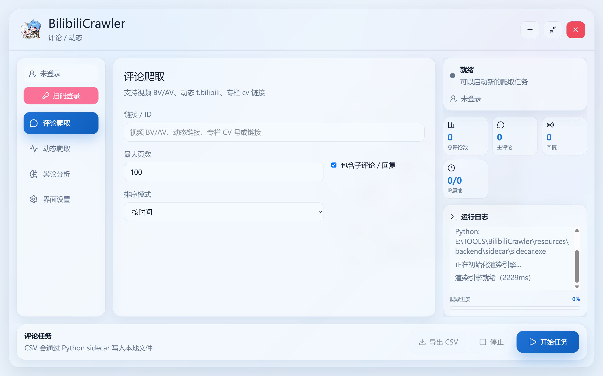
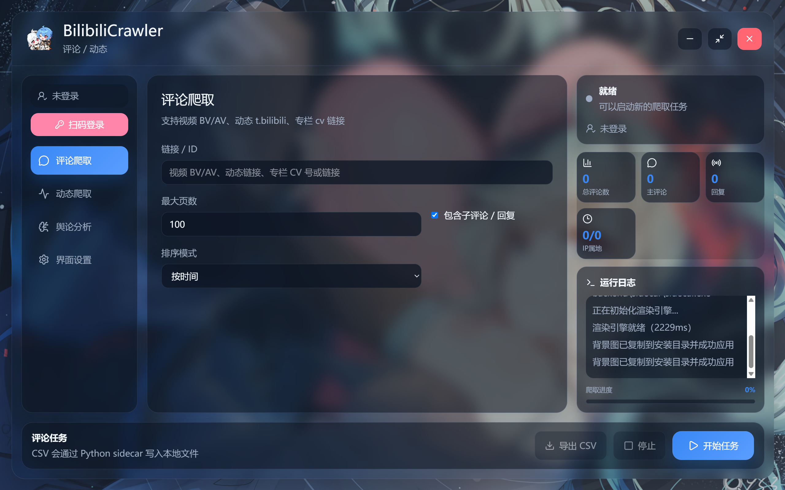

<div align="center">


</div>

<div align="center">

[](https://github.com/Yi-luo-hua/BilibiliCrawler/releases)
[](https://github.com/Yi-luo-hua/BilibiliCrawler/stargazers)
[](LICENSE)
[](https://github.com/Yi-luo-hua/BilibiliCrawler/commits/main)
[](https://github.com/Yi-luo-hua/BilibiliCrawler/pulls)
[](https://github.com/Yi-luo-hua/BilibiliCrawler/releases)

</div>

# BilibiliCrawler

BilibiliCrawler 是一个 B 站评论 / 动态爬取与舆论分析桌面工具。v2.00 起项目迁移为 **Tauri 2 + React + TypeScript** 桌面应用，Python 爬虫和分析逻辑作为本地 sidecar 后端运行，通过本地进程通信完成爬取、扫码登录、LLM 分析和导出。

现已支持MCP调用，请阅读docs/MCP.md。

> 旧版 Python GUI / 单 exe 代码保留在 `legacy-python-gui` 分支。主分支以后以 Windows 安装包桌面应用为主。

本项目先后使用Cursor,Trae,Warp,antigravity,Claude Code,Codex完成。

如果有帮助的话，麻烦点个star⭐️谢谢喵！

如果使用过程中遇到Bug或有新增功能需求请提Issue谢谢喵！

## 界面展示




## 功能

- 评论爬取：支持视频 BV/AV、动态、专栏链接。
- 动态爬取：支持用户空间动态和关注页动态流。
- 扫码登录：关注页动态流可通过 B 站 App 扫码登录。
- 筛选与导出：支持关键词、时间范围、最大页数，导出 CSV。
- 舆论分析：调用 LLM API 分析评论 / 动态主题、风险点、洞察和代表性内容。
- 可视化图表：支持情绪分布、主题排行、时间趋势、等级分布、地域地图、词云图和深度分析模块。
- 词云图：由 Python `wordcloud` 生成 PNG。
- 自定义界面：支持浅色 / 暗色主题、本地背景图、背景透明度和模糊效果。
- MCP 接入：agent 可越过桌面客户端，直接完成爬取与分析，详见 [docs/MCP.md](docs/MCP.md)。

## 下载使用

前往 [Releases](https://github.com/Yi-luo-hua/BilibiliCrawler/releases) 下载最新安装包：

安装后从开始菜单或桌面快捷方式启动即可。安装包面向 Windows x64，默认当前用户安装，不需要额外安装 Python 环境。

## 使用方式

### 评论爬取

1. 进入“评论爬取”页面。
2. 输入视频 BV/AV、动态链接、专栏 CV 号或完整链接。
3. 设置最大页数、排序方式和是否包含子评论。
4. 点击“开始任务”，等待日志和进度完成。
5. 如需更稳定地获取评论 IP 归属地，建议先扫码登录。
6. 点击“导出 CSV”保存结果。

### 动态爬取

1. 进入“动态爬取”页面。
2. 输入用户 UID 或 `space.bilibili.com/xxx` 链接。
3. 留空目标时会尝试爬取关注页动态流，此时需要扫码登录。
4. 可选设置关键词、时间范围和最大页数。
5. 点击“开始任务”，完成后可以导出 CSV。

### 舆论分析

1. 先完成评论或动态爬取，让数据保存在当前 sidecar 会话中。
2. 进入“舆论分析”页面。
3. 填写 请求地址、模型名和 API Key。
4. 数据源会自动匹配当前会话里已经爬取的数据。
5. 选择抽样聚合或全量分批策略，并勾选需要生成的分析模块。
6. 点击“开始分析”，完成后页面会展示所选图表和分析文本。
7. 点击“导出报告”可保存 Markdown 或 JSON 分析结果。

当前分析模块：

- 情绪分布
- 主题排行
- 时间趋势
- 等级分布
- 地域地图
- 词云图
- 舆论深度分析

说明：
- 词云图 PNG 会写入固定资源目录，每次分析创建独立子目录：

```text
%LOCALAPPDATA%\BilibiliCrawler\analysis-assets\
```

子目录命名格式：

```text
YYYYMMDD-HHMMSS-来源标签[-BV号]
```

示例：

```text
20260606-134500-动态
20260606-134500-视频评论-BV1abcdefghij
20260606-134500-动态评论
```

### 评论运行数据

桌面端的评论爬取会为每次任务创建一个独立的 `run_id` 目录，保存 `manifest.json` 和
`comments.json`；有评论数据时还会生成 `comments.csv`。开发环境优先写入：

```text
<仓库>\analysis-runs\<run_id>\
```

仓库目录不可写时回落到 `%LOCALAPPDATA%\BilibiliCrawler\analysis-runs\`；也可以用
`BILIBILI_AGENT_RUNS_DIR` 指定位置。运行数据不会自动删除，长时间大量爬取会持续占用磁盘，
可在确认不再需要导出或分析后手动清理旧的 `run_id` 目录。

manifest 中的 artifacts 路径相对于 run 目录存储（拷贝到其他机器仍可读），视频爬取会额外
记录目标元数据（标题、UP 主、发布时间）。对同一 run 重新分析时，旧的分析结果会移入
`archive/` 子目录保留，新结果使用标准文件名。通过 MCP 的 `list_runs` / `delete_run`
工具（或直接删除目录）可以管理磁盘占用，例如保留最新 N 个运行、清理其余。

当前桌面界面仍只使用本次 sidecar 会话中的任务，不提供重启后的任务恢复入口。评论爬取本身
不需要 LLM API Key，运行目录不会写入 LLM 凭据。

### 界面设置

1. 进入“界面设置”页面。
2. 选择浅色 / 暗色主题。
3. 选择本地背景图。
4. 调整背景透明度和模糊效果；恢复默认会清空自定义背景。

## 导出字段

评论 CSV 默认字段：

- 评论 ID
- 根评论 ID
- 是否为回复
- 用户名
- 用户等级
- 评论内容
- 点赞数
- 回复数
- 发布时间
- IP 归属地
- 父评论 ID
- 用户 ID

以 `=`、`+`、`-`、`@` 等开头的单元格会自动加单引号前缀，防止 Excel 将其当作公式执行；因此 CSV 中个别
以 `-` 开头的评论文本与原文会有一字符之差，完整字段（含时间戳等）以同目录 `comments.json` 为准，
需要程序化对账时请读 JSON。新列只会追加到尾部，按列位置解析的脚本不会因新增列而错位。

动态 CSV 默认字段：

- 动态 ID
- 用户名
- 类型
- 内容
- 发布时间
- 点赞数
- 评论数
- 转发数

分析报告（以下描述适用于运行目录中的报告；桌面端"导出分析"生成的 Markdown 不含溯源头部与评论归因）：

- Markdown：标题会带上视频标题，报告头部含数据来源、UP 主、发布时间与 Run ID 溯源信息，正文包含总结、所选分析模块、情绪分布（含占比）、时间趋势表格、洞察、风险点和带用户名/点赞归因的代表性评论；运行目录中的报告会嵌入 `assets/word_cloud.png` 词云图。
- JSON：完整分析结构，包含可视化图表数据层和元信息（含 `schema_version` 与 `elapsed_seconds` 耗时）。
- Markdown 图表资源会写入报告同级的 assets 目录；词云图直接复用 sidecar 生成的 PNG 文件。

## 源码开发

### 环境要求

- Windows 10/11 x64
- Python 3.10+
- Node.js 20+
- pnpm 10.28.0+
- Rust stable MSVC toolchain

### 安装依赖

```powershell
pip install -r requirements.txt
corepack prepare pnpm@10.28.0 --activate
corepack pnpm --dir desktop install
```

### 开发运行

```powershell
corepack pnpm --dir desktop tauri dev
```

### 构建安装包

正式 Windows 安装包固定使用 **CPython 3.13.15 x64**；这与源码功能支持 Python 3.10+ 是两个约束。
构建脚本会拒绝其他 Python 版本，并用带 SHA-256 的锁文件安装 sidecar 运行时与 PyInstaller 工具链。

```powershell
$ReleasePython = 'C:\path\to\cpython-3.13.15-venv\Scripts\python.exe'
powershell -ExecutionPolicy Bypass -File scripts\build_installer.ps1 -Python $ReleasePython
```

应用版本以 `desktop/src-tauri/Cargo.toml` 的 `[package].version` 为唯一来源；Tauri 和构建脚本会自动读取该版本，`Cargo.lock` 由 Cargo 同步更新。构建流程使用锁定的 pnpm 版本、冻结锁文件和审核后的依赖构建脚本。

产物位于：

```text
desktop\src-tauri\target\release\bundle\nsis\
```

### MCP / agent 接入

除桌面客户端外，还可以让 agent 通过本地 MCP 服务器直接爬取和分析，无需启动界面。

```powershell
python -m venv .venv-agent
.venv-agent\Scripts\python.exe -m pip install -r requirements-agent.txt
```

在 MCP 宿主里把命令配成 `.venv-agent\Scripts\python.exe -m backend.agent mcp`，
`cwd` 指向仓库根目录。也可以直接当命令行用：

```powershell
.venv-agent\Scripts\python.exe -m backend.agent crawl-comments "BV1GJ411x7h7" --max-pages 1
```

完整的工具清单、凭据配置、安全说明与故障排查见 [docs/MCP.md](docs/MCP.md)。

### 回归测试

```powershell
python -m unittest discover -s tests -v
python -m py_compile backend\sidecar.py src\processor\analysis_processor.py
node --experimental-strip-types --test desktop\tests\*.test.ts
desktop\node_modules\.bin\tsc.cmd --noEmit -p desktop\tsconfig.json
cargo check --manifest-path desktop\src-tauri\Cargo.toml --locked
```

## 项目结构

```text
BilibiliCrawler/
├─ assets/                         应用 logo 与图标资源
├─ backend/
│  ├─ agent.py                    薄 CLI，也是 MCP 服务器启动入口
│  ├─ mcp_server.py               MCP stdio 适配层（7 个工具）
│  └─ sidecar.py                   Python sidecar 入口，与 Tauri 进程通信
├─ config/
│  └─ config.py                    全局配置
├─ desktop/                        Tauri + React 桌面前端
│  ├─ public/
│  │  └─ favicon.png
│  ├─ src/
│  │  ├─ assets/
│  │  │  └─ app_logo.png
│  │  ├─ components/
│  │  │  ├─ AnalysisWorkspace.tsx  舆论分析配置与可视化仪表盘
│  │  │  ├─ BackgroundLayer.tsx    自定义背景图层
│  │  │  ├─ BottomActionBar.tsx    底部任务控制与导出
│  │  │  ├─ RightPanel.tsx         右侧日志和进度面板
│  │  │  ├─ SideNav.tsx            侧边导航
│  │  │  ├─ TaskWorkspace.tsx      评论 / 动态任务表单
│  │  │  └─ TitleBar.tsx           自定义标题栏
│  │  ├─ lib/
│  │  │  ├─ analysisCharts.ts      分析图表、地图和导出资产工具
│  │  │  ├─ dynamicTarget.ts       动态 UID / 空间链接校验
│  │  │  ├─ sidecarClient.ts       带请求关联与超时的 sidecar 客户端
│  │  │  ├─ tauri.ts               Tauri invoke 封装
│  │  │  └─ titleBarInteraction.ts 标题栏拖动与双击最大化交互
│  │  ├─ state/
│  │  │  └─ taskState.ts           爬取 / 分析任务状态机
│  │  ├─ App.tsx
│  │  ├─ main.tsx
│  │  ├─ styles.css
│  │  └─ types.ts
│  ├─ src-tauri/
│  │  ├─ src/
│  │  │  └─ main.rs                Tauri Rust 入口和 sidecar 管道
│  │  ├─ capabilities/
│  │  ├─ icons/
│  │  ├─ Cargo.toml
│  │  └─ tauri.conf.json
│  ├─ tests/                       桌面状态机与通信单元测试
│  ├─ package.json
│  ├─ pnpm-workspace.yaml          pnpm 依赖脚本审核配置
│  └─ vite.config.ts
├─ scripts/
│  ├─ build_backend.ps1            安装 Python 依赖并用 PyInstaller 构建 sidecar
│  └─ build_installer.ps1          NSIS 安装包构建
├─ src/
│  ├─ api/bilibili_api.py          B 站 API 封装
│  ├─ crawler/comment_crawler.py   评论爬虫
│  ├─ crawler/dynamic_crawler.py   动态爬虫
│  ├─ exporter/csv_exporter.py     CSV 导出
│  ├─ processor/
│  │  ├─ analysis_processor.py     LLM 舆论分析和词云图生成
│  │  └─ data_processor.py         数据清洗与统计
│  └─ service/                    headless 业务层，MCP 与 CLI 共用
│     ├─ agent_service.py         编排、状态机、取消与持久化
│     ├─ credentials.py           LLM 凭据解析（不落盘、不进日志）
│     ├─ models.py                状态、错误码与默认值
│     ├─ paths.py                 输出目录选择
│     └─ run_store.py             run 目录读写与路径收敛
├─ tests/
│  ├─ fixtures/
│  ├─ test_adapter_channel.py       sidecar RPC 通道回归测试
│  ├─ test_agent_service.py         headless 服务层回归测试
│  ├─ test_analysis_cancellation.py 分析停止与阻塞请求回归测试
│  ├─ test_caller_policy.py         调用者策略回归测试
│  ├─ test_dynamic_crawler.py       动态分页、异常与停止回归测试
│  ├─ test_mcp_server.py            MCP 工具契约与不可信内容测试
│  ├─ test_sidecar_analysis.py      sidecar 与分析回归测试
│  └─ test_sidecar_characterization.py sidecar 端到端特征基准测试
├─ utils/
│  └─ helpers.py                   链接解析等工具函数
├─ requirements.txt
├─ requirements-agent.txt          MCP / CLI 额外依赖
├─ requirements-desktop.lock       Windows sidecar 锁定运行时依赖
├─ requirements-build.in           Windows sidecar 构建工具直接依赖
└─ requirements-build.txt          Windows sidecar 带哈希构建锁
```

## 更新日志

### v3.3.0（待发布）
- 桌面评论爬取与 `source == "comments"` 的分析已迁入共享 `AgentService`，同时保留既有 RPC、事件、取消、空结果和 source 回退契约。
- 新增适配器 outcome 通道与类型化事件，并补齐终态读取、深拷贝所有权、默认关闭零额外调用及取消竞态的回归覆盖。
- 新增真实 `SidecarClient` 跨进程端到端测试，覆盖请求关联、进度事件、完成事件、取消与重试。
- 强化 run 存储、报告与 CSV 导出：归一化相对产物路径、历史分析归档、元数据与来源记录、运行列举/删除、公式注入防护及流式 JSON 写入。
- `analysis.json`、Markdown 报告和分析归档现在都会递归脱敏已注册凭据；词云损坏或超限时只报告 warning，不再生成失效链接。
- 分析 JSON、Markdown 与词云采用整组 staging + 原子提交，失败时回滚，避免分析产物只更新一部分。
- MCP 扩展为 7 个工具，新增持久化 run 的列举与删除能力。
- 发布前仍须完成 `docs/RELEASE_3.3.0.md` 中的 Tauri 真机验收；验收完成后再填写发布日期并创建标签。

### v3.2.0 (2026.08.25)
- 新增本地 MCP 服务器，agent 可越过桌面客户端直接完成「爬取 → 分析 → 导出报告」，对应 Issue #3。
- 新增 headless 业务层 `src/service/`，运行结果按 `run_id` 落盘，MCP 进程重启后仍可继续分析。
- 新增薄 CLI `python -m backend.agent`，同一套能力可脱离 MCP 宿主直接使用。
- MCP 工具采用有界阻塞：超过等待窗口即返回 `run_id` 供轮询，长任务不会被宿主单次调用超时打断。
- 强化不可信内容处理：评论相关的 system prompt 明确禁止执行评论内夹带的指令，工具返回的摘要带不可信标记并限长，原文引用不进入返回值。
- headless 默认爬取页数下调为 5、硬上限 50，且不可被工具参数突破。
- 上游报错中回显的 API Key 会被脱敏，不会写入 manifest、日志或工具返回值。
- run 目录下所有文件采用临时文件 + 原子替换写入，进程中途被杀不会留下截断的 manifest。
- 停止任务在导出阶段落下时也会正确判定为已取消，不会被完成状态覆盖；停止与终态提交在同一把锁内完成，不会出现内存与 manifest 状态不一致。
- 开始爬取前发出的停止请求现在真正生效，不会再因爬虫入口重置停止标志而空跑一轮网络请求。
- 中途停止会保留已经爬到的评论，与 stop_task 的提示一致。
- CSV 导出失败会在 warnings 中明确报告，不再静默按成功处理。
- 修复停止真实爬虫时的无限递归：爬虫 stop() 会写进度日志并重新进入进度回调，现改为可重入保护，停止在真实链路上可用且不会误判为失败。
- 修正凭据自动探测路径：按 tauri.conf.json 的 installMode=currentUser，默认安装位置是 `%LOCALAPPDATA%\BilibiliCrawler`，此前误写为其下的 Programs 子目录。
- 取消任务时的提示按是否真的落盘了数据区分，不再无条件声称保留了部分结果。
- 取消发生在爬虫构造期间时直接短路，不再发出 BV/动态元数据请求；此前虽不会抓取评论分页，但仍会调用一次视频信息接口。
- 修复词云取消测试在冷启动首次运行时因字体缓存构建而偶发超时的问题。
- 桌面评论爬取接入共享 `AgentService`，保留现有 RPC、空结果和停止语义，并将评论运行数据按 `run_id` 落盘。

### v3.1.1 (2026.07.27)
- 修复自定义标题栏双击无法最大化或还原窗口的问题，并补充标题栏单击拖动、双击切换最大化的回归测试。
- 修复扫码登录、选择背景和关闭按钮在鼠标悬浮时背景变白或透明的问题，同时保留蓝色主操作按钮的现有效果。
- 将应用版本统一由 `Cargo.toml` 管理，Tauri 配置、前端包和安装脚本不再重复维护版本号。

### v3.1.0 (2026.07.27)
- 修复动态接口异常被误报为成功获取 0 条的问题，网络、登录和风控错误现在会进入明确的失败流程。
- 修复无效动态 UID 静默切换关注流，以及混合新旧时间戳页面导致提前停止、遗漏后续有效动态的问题。
- 改进动态停止响应，OPUS 文字补齐期间可快速结束任务；空间动态与关注动态共用统一分页流程，减少重复代码。
- 修复舆论分析在 LLM 请求或词云生成期间点击停止长时间无响应的问题，阻塞阶段会持续检查取消信号。
- 新增独立的 `cancelled` 业务状态，主动停止不再显示为分析失败，停止后可以立即重新开始任务。
- 加强 sidecar 服务依赖注入、RPC 请求关联、任务状态机以及动态 / 分析取消链路的自动化回归覆盖。

### v3.0.1 (2026.06.06)
- 修复 LLM 返回非标准 JSON（尾随逗号、嵌套对象截断）导致分析失败的问题，改用括号计数解析 + 尾逗号修复回退。
- 修复词云图在前端不显示的问题：sidecar 改以 base64 编码传输 PNG，不再依赖 asset 协议文件路径。

### v3.00 (2026.06.06)
- 新增舆论分析工作区，支持评论 / 动态数据源、LLM 请求配置、抽样聚合和全量分批分析。
- 新增主题排行、时间趋势、等级分布、地域地图、词云图和舆论深度分析可视化模块。
- 新增 Markdown / JSON 分析报告导出，Markdown 可携带图表资源和词云 PNG。
- 新增 `wordcloud` / `jieba` / `matplotlib` 依赖打包校验，安装包内置 Python sidecar 依赖，用户无需额外安装 Python 包。
- 改进桌面交互与任务状态展示，补充 sidecar 分析回归测试。

### v2.00 (2026.05.27)
- 主架构迁移到 Tauri 2 + React 19 + TypeScript + Vite + Tailwind。
- Python 爬虫逻辑改为 sidecar 后台进程，前端通过 JSON 请求 / 事件通信。
- 发布形式从单 exe 改为 NSIS 安装包。
- 新增风格化桌面 UI、玻璃面板、自定义背景、运行日志和进度条。
- 动态图文内容支持多图链接导出。
- 修复扫码登录 cookie 提取、限流重试、CSV 空数据导出等问题。

### v1.30 (2026.05.25)
- 新增动态爬取模式（用户空间 + 关注页动态流）
- 新增扫码登录功能
- 评论/动态双模式 GUI，关键词筛选 + 时间范围过滤

### v1.20 (2026.04.01)
- 支持动态评论和专栏文章评论爬取
- 自动识别输入类型，新增统一解析器

### v1.10 (2026.02.15)
- 子评论并发爬取（4线程），自适应请求延迟
- Light / Dark 双主题切换

### v1.0.0 (2025.12.9)
- 初始版本，支持视频评论爬取 + GUI + CSV导出

## 许可证

[MIT License](LICENSE)

## 免责声明

本项目仅供学习和研究使用，请遵守 B 站相关协议和法律法规。
