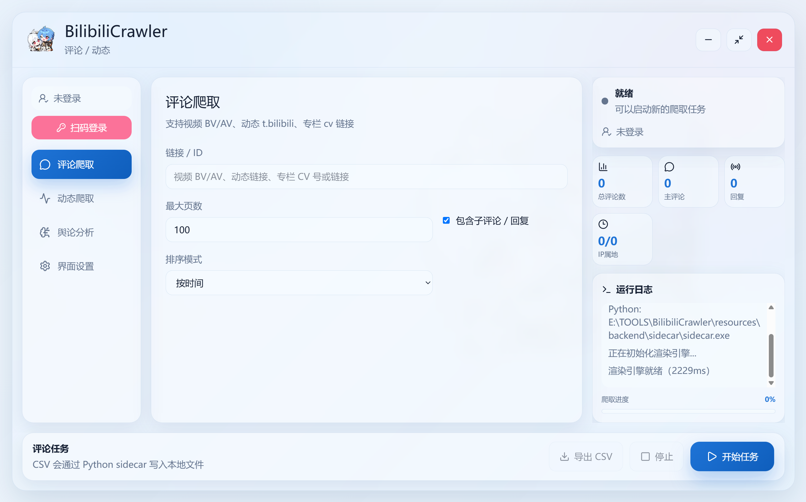
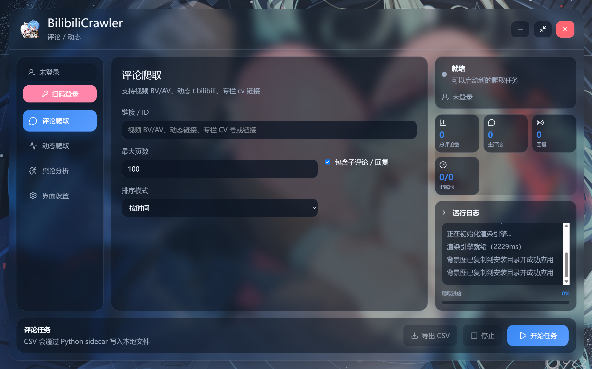

<div align="center">


# BilibiliCrawler

**面向用户与 AI Agent 的 B 站评论 / 动态爬取与 LLM 舆论深度分析工具**

[](https://github.com/Yi-luo-hua/BilibiliCrawler/releases)
[](https://github.com/Yi-luo-hua/BilibiliCrawler/stargazers)
[](LICENSE)
[](https://github.com/Yi-luo-hua/BilibiliCrawler/commits/main)
[](https://github.com/Yi-luo-hua/BilibiliCrawler/pulls)
[](https://github.com/Yi-luo-hua/BilibiliCrawler/releases)

<p align="center">
  <a href="README_EN.md">English</a> | <b>简体中文</b>
</p>

[下载客户端 (Windows)](https://github.com/Yi-luo-hua/BilibiliCrawler/releases) • [MCP 接入指南](docs/MCP.md) • [开发计划与架构](docs/FORWARD_PLAN.md) • [更新日志](CHANGELOG.md)

</div>

本项目先后使用Cursor,Trae,Warp,antigravity,Claude Code,Codex完成。  
如果有帮助的话，麻烦点个star⭐️谢谢喵！  
如果使用过程中遇到Bug或有新增功能需求请提Issue谢谢喵！

---

## 📖 目录

- [✨ 核心特性](#-核心特性)
- [⚖️ 使用形态与能力对照](#️-使用形态与能力对照)
- [🚀 快速上手](#-快速上手)
  - [方式一：桌面客户端（推荐普通用户，免 Python 环境）](#方式一桌面客户端推荐普通用户免-python-环境)
  - [方式二：MCP 协议接入（推荐 AI Agent）](#方式二mcp-协议接入推荐-ai-agent)
  - [方式三：命令行 CLI 爬取与分析](#方式三命令行-cli-爬取与分析)
- [🖥️ 桌面端功能指引](#️-桌面端功能指引)
- [📊 数据导出与运行归档](#-数据导出与运行归档)
- [🛠️ 源码开发与构建](#️-源码开发与构建)
- [📁 核心项目结构](#-核心项目结构)
- [📝 版本更新亮点](#-版本更新亮点)
- [📄 许可证与免责声明](#-许可证与免责声明)

---

## ✨ 核心特性

- **完整深度的评论抓取**：全面支持视频（BV/AV）、动态、专栏文章评论；支持完整楼中楼回复自动递归分页抓取，`max_pages=0` 可完整爬取全部评论。
- **动态与关注流爬取**：支持指定用户 UID 空间动态，或通过 App 扫码登录抓取个人关注页动态流。
- **LLM 舆论深度洞察**：对接兼容 OpenAI 格式的大语言模型（支持自定义 Base URL、模型名与 Key），支持抽样聚合与全量分批分析，输出情绪占比、主题排行、社会学/心理学深度透视与自定义分析视角。
- **丰富的可视化呈现**：情绪分布环形图、主题排行条形图、时间热度趋势、用户等级分布、全国/海外地域地图热力图及 Python 词云图生成。
- **现代化桌面体验**：基于 **Tauri 2 + React 19 + TypeScript + TailwindCSS** 打造，轻量原生，支持浅色/暗色主题、磨砂玻璃拟态、本地壁纸背景与毛玻璃特效。
- **原生支持 MCP (Model Context Protocol)**：已发布至 PyPI，AI Agent（Claude Desktop、Antigravity、Cursor、Cline 等）无需启动桌面端，即可越过界面直接调用爬取与分析工具。
- **严密的安全设计**：LLM 凭据全程内存保密、绝不落盘与进日志；抓取的评论内容自动封装安全标记 `<untrusted-data>`，防止 Prompt 注入攻击；CSV 导出内置防公式注入保护。

---

## ⚖️ 使用形态与能力对照

本项目提供桌面端与命令行/MCP 两套使用形态，请根据场景选择：

| 功能模块 | 桌面客户端 (GUI) | 命令行 (CLI) | MCP Server (AI Agent) |
| :--- | :---: | :---: | :---: |
| **视频 / 动态 / 专栏评论爬取** | ✅ (支持主评论+楼中楼) | ✅ | ✅ |
| **用户空间动态 / 关注流动态** | ✅ (含 B 站扫码登录) | ❌ | ❌ |
| **IP 属地解析** | ✅ (需扫码登录) | ✅ (配置 `BILIBILI_COOKIE`) | ✅ (配置 `BILIBILI_COOKIE`) |
| **LLM 舆论分析** | ✅ (抽样 / 全量) | ✅ | ✅ |
| **自定义分析视角 (Prompt)** | ✅ | ✅ | ✅ |
| **交互式图表展示** | ✅ (Recharts + 地图) | ❌ | ❌ |
| **词云图生成 (PNG)** | ✅ (内置支持) | ✅ (需 `[analysis]` extra) | ✅ (需 `[analysis]` extra) |
| **报告导出格式** | CSV / Markdown / JSON | CSV / Markdown / JSON | 结构化 ToolResult / 相对文件路径 |
| **运行依赖环境** | 仅 Windows 10/11 x64<br>(**免安装 Python**) | Python 3.10+ | Python 3.10+ |

---

## 🚀 快速上手

### 方式一：桌面客户端（推荐普通用户，免 Python 环境）

1. 前往 [GitHub Releases](https://github.com/Yi-luo-hua/BilibiliCrawler/releases) 下载最新的 Windows 安装包（如 `BilibiliCrawler-Setup-3.7.0-x64.exe`）。
2. 双击安装后直接从桌面或开始菜单启动即可，**无需预装 Python、Node.js 或任何运行库**。
3. 界面展示：

<div align="center">
  
  
</div>

---

### 方式二：MCP 协议接入（推荐 AI Agent）

本项目已发布至 PyPI，任何支持 MCP 协议的 Agent 客户端均可轻松集成：

#### 1. 安装包与环境配置
```powershell
# 推荐新建专用虚拟环境
python -m venv .venv-agent
.venv-agent\Scripts\pip install "bilibili-crawler[mcp]"

# 验证安装
.venv-agent\Scripts\bilibili-crawler doctor
```

#### 2. 配置到 MCP 客户端
以 Claude Desktop、Cursor 或 Antigravity 为例，在配置文件中的 `mcpServers` 节点添加：

```json
{
  "mcpServers": {
    "bilibili-crawler": {
      "command": "C:\\path\\to\\.venv-agent\\Scripts\\bilibili-crawler-mcp.exe",
      "args": [],
      "env": {
        "BILIBILI_LLM_BASE_URL": "https://api.openai.com/v1",
        "BILIBILI_LLM_MODEL": "gpt-4o-mini",
        "BILIBILI_LLM_API_KEY": "sk-...",
        "BILIBILI_COOKIE": "SESSDATA=your_sessdata; bili_jct=your_jct",
        "PYTHONIOENCODING": "utf-8"
      }
    }
  }
}
```

> **提示**：
> - **LLM 凭据**：仅分析类工具需要；纯爬取无需配置。若本机已在桌面端配置过 LLM，MCP 会自动发现并复用，无需在配置中明文写 Key。
> - **BILIBILI_COOKIE**：可选配置。配置后 B 站返回评论的 IP 属地；留空则匿名爬取（属地字段为空）。
> - 完整工具清单（`crawl_and_analyze`、`get_task_status`、`stop_task` 等）及调用说明详见 [docs/MCP.md](docs/MCP.md)。

---

### 方式三：命令行 CLI 爬取与分析

无需启动界面，单条命令即可完成爬取与分析：

```powershell
# 1. 基础爬取：只爬取视频前 5 页评论（保存为 JSON / CSV，不调用 LLM）
bilibili-crawler crawl-comments "BV1GJ411x7h7" --max-pages 5

# 2. 深度爬取并结合 LLM 分析（爬完整个评论区，支持自定义分析视角）
# 注：LLM 凭据会自动读取桌面端已配置项，或通过环境变量设置 (BILIBILI_LLM_API_KEY / BASE_URL / MODEL)
bilibili-crawler crawl-and-analyze "BV1GJ411x7h7" `
  --max-pages 0 `
  --strategy sample `
  --sample-size 500 `
  --custom-module "争议焦点=请分析评论区争议最激烈的分歧点是什么"

# 3. 对已有运行目录 (run_id) 重新进行不同维度的 LLM 分析
bilibili-crawler analyze-run "20260928-120000-video-BV1GJ411x7h7" `
  --charts "sentiment_distribution,deep_analysis"
```

---

## 🖥️ 桌面端功能指引

### 1. 评论爬取
- **目标支持**：直接粘贴视频链接、BV/AV 号、动态链接（如 `t.bilibili.com/...`）或专栏文章链接（`cv...`）。
- **参数控制**：可按需配置最大页数（`0` 为无限制爬完）、排序方式（最新/最热）及是否抓取楼中楼子评论。
- **属地获取**：获取 IP 归属地需点击右上角「扫码登录」绑定当前会话。

### 2. 动态爬取
- **空间动态**：输入目标 UP 主的 UID 或个人空间链接。
- **关注页动态**：目标输入留空，扫码登录后直接抓取您账号的关注流更新。
- **筛选过滤**：支持设置关键词过滤、发布时间范围（如最近 24 小时、最近 7 天）与最大抓取页数。

### 3. 舆论分析
- **模型配置**：兼容 OpenAI API 格式，填入服务商 Base URL、模型名称与 API Key。
- **分析策略**：支持「抽样聚合」（快速提炼）与「全量分批」（宏观全貌统计）。
- **模块勾选**：自由开关情绪分布、主题排行、时间趋势、等级分布、地域地图、深度分析、词云图及自定义视角。
- **报告导出**：一键导出 Markdown 格式（附带溯源信息与内嵌词云）或 JSON 结构化数据。

### 4. 界面个性化
- 支持浅色 / 暗色两套主题。
- 支持选取本地任意图片作为窗口壁纸，支持自由调节透明度与背景毛玻璃模糊强度。

---

## 📊 数据导出与运行归档

### 运行数据存储 (`run_id`)
每次爬取或分析都会在本地生成隔离的运行目录（包含 `manifest.json`、`comments.json`、`comments.csv`、`analysis.json` 等）：
- 优先存储位置：`<项目目录>\analysis-runs\<run_id>\`
- 生产回落位置：`%LOCALAPPDATA%\BilibiliCrawler\analysis-runs\<run_id>\`

### 导出字段对照
- **评论 CSV 字段**：`评论 ID`、`根评论 ID`、`是否为回复`、`用户名`、`用户等级`、`评论内容`、`点赞数`、`回复数`、`发布时间`、`IP 归属地`、`父评论 ID`、`用户 ID`。
  *(以 `=,+,-,@` 开头的文本会自动增加单引号前缀，避免 Excel 公式注入)*
- **动态 CSV 字段**：`动态 ID`、`用户名`、`类型`、`内容`、`发布时间`、`点赞数`、`评论数`、`转发数`。

---

## 🛠️ 源码开发与构建

### 开发环境要求
- **操作系统**：Windows 10/11 x64
- **Node.js**：20+ (推荐使用 `pnpm 10.28.0+`)
- **Python**：3.10+ (正式安装包发布需 CPython 3.13.15 x64)
- **Rust**：Stable MSVC 工具链

### 1. 本地依赖安装与运行
```powershell
# 1. 安装 Python 核心依赖
pip install -r requirements.txt

# 2. 安装前端依赖
corepack prepare pnpm@10.28.0 --activate
corepack pnpm --dir desktop install

# 3. 启动开发模式（Tauri 桌面热重载）
corepack pnpm --dir desktop tauri dev
```

### 2. 回归测试
项目保持着高标准的自动化测试体系：
```powershell
# Python 端回归测试 (27 个模块，430+ 项测试)
python -m unittest discover -s tests -v

# 前端类型检查与单元测试
corepack pnpm --dir desktop typecheck
node --experimental-strip-types --test desktop\tests\*.test.ts

# Rust 宿主编译检查
cargo check --manifest-path desktop\src-tauri\Cargo.toml --locked
```

### 3. 构建发布安装包
```powershell
# 调用自动化脚本完成 sidecar 封包与 NSIS 安装程序生成
powershell -ExecutionPolicy Bypass -File scripts\build_installer.ps1 -Python "path\to\python.exe"
```
产物将输出至：`desktop\src-tauri\target\release\bundle\nsis\`。

---

## 📁 核心项目结构

```text
BilibiliCrawler/
├─ bilibili_crawler/       # 唯一 Python 核心实现与可分发包
│  ├─ api/                 # B 站 API 封装与会话处理
│  ├─ crawler/             # 评论与动态分页抓取引擎
│  ├─ processor/           # LLM 舆论分析、文本处理与词云
│  ├─ service/             # 核心业务层 (AgentService、任务持久化、凭据管理)
│  ├─ sidecar.py           # 桌面端 Tauri IPC 管道通信适配器
│  ├─ mcp_server.py        # MCP 协议 stdio 服务端实现
│  └─ agent.py             # 命令行 CLI 入口
├─ desktop/                # Tauri 2 + React 19 桌面应用源码
│  ├─ src/                 # 前端界面、组件、图表与状态机
│  └─ src-tauri/           # Rust 宿主工程与 sidecar 进程管理
├─ docs/                   # 专项设计文档、MCP 规范与发布记录
├─ scripts/                # 构建、打包校验与发布自动化脚本
├─ tests/                  # 自动化回归测试套件
├─ pyproject.toml          # Python 包规范元数据
└─ CHANGELOG.md            # 完整历史版本更新日志
```

---

## 📝 版本更新亮点

### 🌟 v3.7.0 (最新发布)
- **全面解除抓取限制**：评论区 `max_pages=0` 支持全量爬完，楼中楼子评论支持全部按需自动递归翻页。
- **Cookie 会话与 IP 属地**：CLI 与 MCP 支持 `BILIBILI_COOKIE`，可完整解析 B 站评论的真实归属地。
- **桌面全量分析修复**：修复桌面端全量分析偶尔回退到默认 300 条抽样的问题，真实分析全部样本。
- **安全与稳定性强化**：完善词云图与自定义模块在各调用端下的表现，严格隔离不可信数据与凭据日志。

👉 **[点击查阅完整历史更新日志 (v1.0.0 ~ v3.7.0) »](CHANGELOG.md)**

---

## 📄 许可证与免责声明

### 许可证
本项目采用 [MIT License](LICENSE) 开源。

### 免责声明
本项目仅供学习和研究使用。请使用者严格遵守 B 站相关开发者协议、服务条款及相关法律法规。
